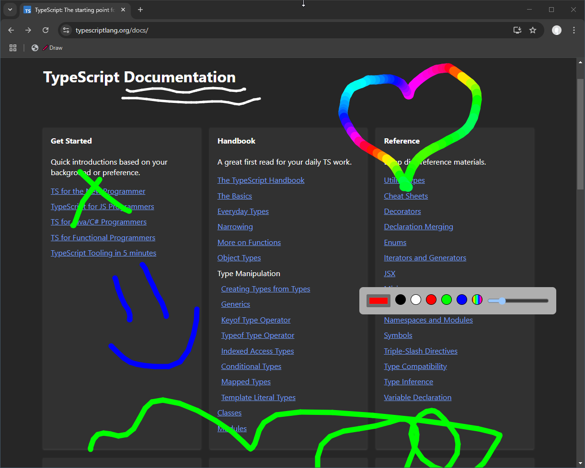

# 🎨 Drawing Bookmarklet - Unleash Your Creativity!

Want to add a personal touch to any webpage? With this bookmarklet, you can draw directly on any site! Whether you’re doodling, making quick notes, or just having fun, this tool makes it easy. Ready to get started? Here's how:

## 🚀 How to Install:

1. Grab the JavaScript file from [dist/bookmarklet.js](dist/bookmarklet.js).
2. Open the file in your favorite text editor and copy everything inside.
3. Head over to your browser and add a new bookmark. Consider naming it `🖍️Draw` !
4. In the bookmark’s URL field, paste the JavaScript you copied (don't forget the `javascript:` prefix).

## ✨ How to Use:

1. **Activate the fun**: Click on the bookmarklet to enter drawing mode.
2. **Set your tools**: Use the controls at the top of the page to customize your drawing experience. Move them around by dragging for a perfect view!
3. **Draw to your heart's content**: Click and drag anywhere on the page to start drawing.
4. **Oops? No problem**: Press `Ctrl + Z` to undo your last move.
5. **Exit the art studio**: Hit the `Esc` key to leave drawing mode.
6. **Bring it back**: Click the bookmarklet again to return to your drawing action.

## 📸 Screenshot

Let your creativity flow!
